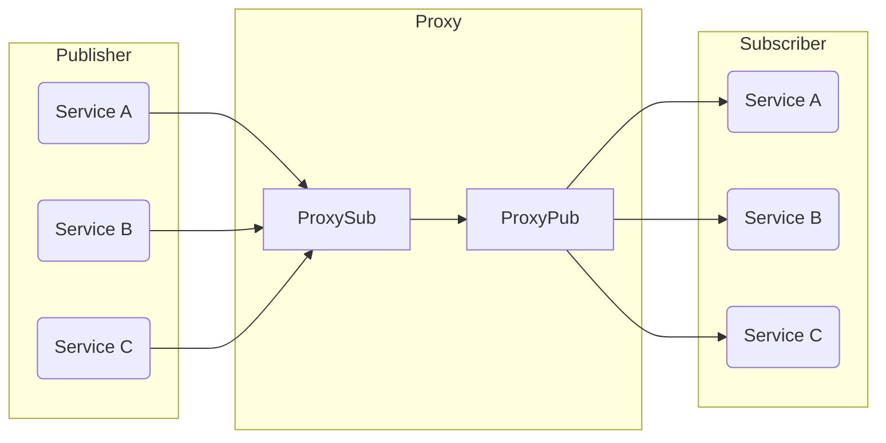

# cppzmq-ipc

一个基于[ZeroMQ]实现的订阅发布机制**IPC**通信库。

## 开始

### 1. zmq_ipc

```c++
#include "zmq_ipc.h"

int main(){
  ZmqIpc zipc;
  auto callback = [](const std::string &topic, const std::vector<uint8_t> &message) {
    std::cout << topic << std::endl;
    for (auto &byte : message) {
      // 处理消息
    }
  };
  zipc.Init(callback, 8, "tcp://localhost:5556", "tcp://localhost:5555");
  zipc.Subscribe("hello"); // 订阅主题为“hello”的消息
  zipc.Publish("hello", {'w', 'o', 'r', 'l', 'd'}); // 发送主题为“hello”的消息，消息内容为“world"
  zipc.Unsubscribe("hello"); // 取消订阅主题为“hello”的消息
}
```

### 2. zmq_proxy

**消息发布订阅的中继代理。**

```shell
A relay agent for subscriptions and publications
Usage:
  zmq_proxy [OPTION...]

  -h, --help            Print usage
  -d, --debug           Enable debugging
  -v, --version         Print version information and then exit
  -t, --tcp             Use TCP as the channel
  -i, --ipc             Use IPC as the channel
  -s, --subscriber arg  Subscriber, such as "ipc:///tmp/zmq_proxy_pub" or 
                        "tcp://*:5555"
  -p, --publisher arg   Publisher, such as "ipc:///tmp/zmq_proxy_sub" or 
                        "tcp://*:5556"
```

## 设计

初始的`Pub-sub`通信方式实现了一个发布者，多个订阅者的通信模型，但是如果存在多个发布者和多个订阅者时，就会让链路变复杂。

于是设置中继代理，让所有服务发布消息到代理的订阅端口；同时所有服务也从代理的发布端口接收广播。

而代理的功能就是把所有来自订阅端口的消息转发到发布端口。



[ZeroMQ]: https://zeromq.org/ "ZeroMQ"
